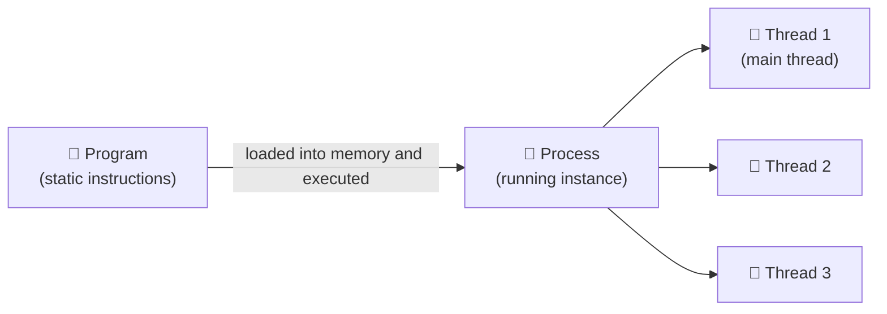
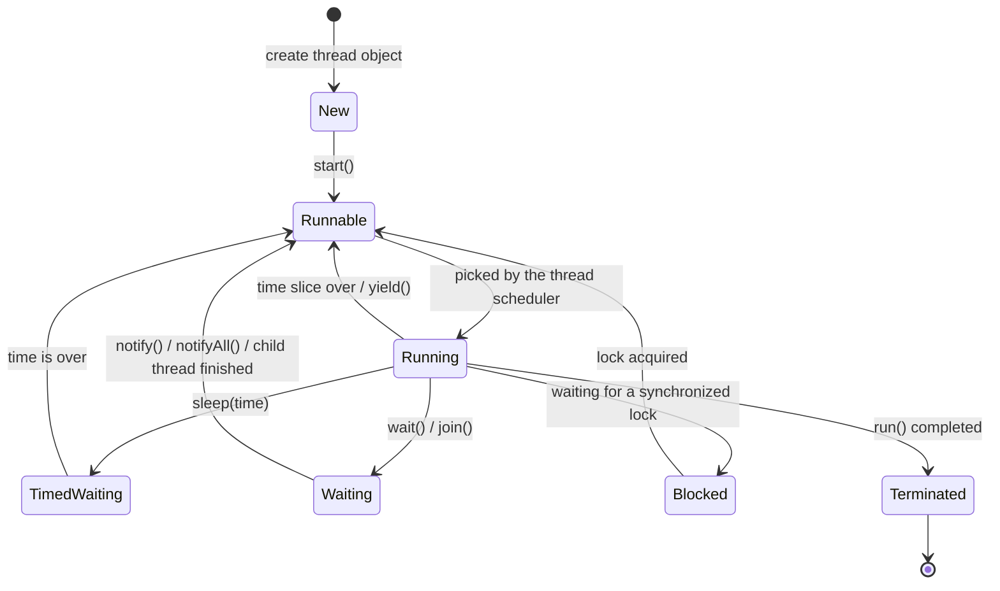
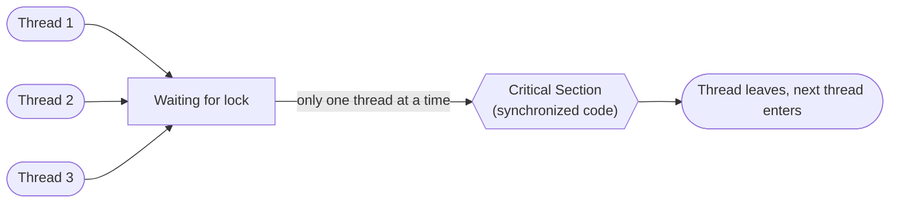

# 🧵 Multi-Threading in Java


> A beginner-friendly guide to multi-tasking, processes, threads, the thread life cycle, and synchronization in Java.

---

## 📑 Table of Contents

| # | Section |
|---|---------|
| 1 | [Multi-Tasking Related Terms](#-1-multi-tasking-related-terms) |
| 2 | [Basic Prerequisites for Multi-Tasking](#-2-basic-prerequisites-for-multi-tasking) |
| 3 | [Multi-Processing in Detail](#-3-multi-processing-in-detail) |
| 4 | [Multi-Threading in Detail](#-4-multi-threading-in-detail) |
| 5 | [Implementation of a Thread](#-5-implementation-of-a-thread) |
| 6 | [Life Cycle of a Thread](#-6-life-cycle-of-a-thread) |
| 7 | [Important Methods of the Java Multi-Threading Model](#-7-important-methods-of-the-java-multi-threading-model) |
| 8 | [Critical Section](#-8-critical-section) |
| 9 | [wait(), notify() and notifyAll()](#-9-wait-notify-and-notifyall) |
| 10 | [Key Takeaways](#-10-key-takeaways) |

---

## 🧠 1. Multi-Tasking Related Terms

There are multiple terms in programming that are related to concurrency and multi-tasking. Some of the common terms include:

| Term | Meaning | Examples |
|------|---------|----------|
| **Multi-User** | A single copy of the operating system is used by multiple users at the same time. Each user has their own terminal and can run their own programs independently of other users. | Unix, Linux, Windows Server |
| **Multi-Core** | A microprocessor contains two or more independent processing units. Each unit is called a **core**, and the processor is called a **multi-core processor**. It can execute multiple instructions in parallel, which improves performance and efficiency. | Intel Core i7, AMD Ryzen, ARM Cortex |
| **Multi-Tasking** | The ability of a system to execute multiple tasks at the same time (concurrently). Multi-tasking achieves **concurrency**. | Running a browser and a music player together |

---

## 📚 2. Basic Prerequisites for Multi-Tasking

| Term | Definition |
|------|------------|
| **Program** | A set of static instructions written by a programmer in a human-understandable language. |
| **Process** | A running instance of a program. `myexe` is an executable, not a process. When `myexe` is loaded into memory and executed, it becomes a process. |
| **Thread** | A lightweight part of a process. A thread does not have its own existence; it resides inside a process. |
| **Multi-Processing** | A type of multi-tasking where multiple tasks are executed by separate processes. |
| **Multi-Threading** | A type of multi-tasking where multiple threads are executed within a single process. Here, concurrency is achieved. |



---

## 🏭 3. Multi-Processing in Detail

1. In multi-processing, multiple processes are created, and each process has a separate memory space.
2. For each process, a unique number is assigned by the operating system, which is called the **PID (Process ID)**.
3. Every process contains at least one thread, which is called the **main thread**.

---

## 🪢 4. Multi-Threading in Detail

1. In multi-threading, there is one process and multiple threads which reside inside the process.
2. There is no separate memory space for threads; they share the memory of their process.
3. For each thread, a unique ID is assigned (the thread ID, `t_id`).
4. Creating a thread is cheaper than creating a process, so operating systems prefer multiple threads over multiple processes.

### Process vs Thread

| Feature | Process | Thread |
|---------|---------|--------|
| Memory space | Separate for each process | Shared with the process |
| Identifier | PID (Process ID) | `t_id` (Thread ID) |
| Weight | Heavy | Lightweight |
| Existence | Independent | Resides inside a process |

---

## 💻 5. Implementation of a Thread

Java supports multi-threading as a built-in feature, so there is no need to install any library for it.

There are two ways in which we can achieve multi-threading:

### a) By extending the `Thread` class

```java
class Demo extends Thread {
    @Override
    public void run() {
        // logic
        System.out.println("Running: " + Thread.currentThread().getName());
    }
}
```

### b) By implementing the `Runnable` interface

```java
class Demo implements Runnable {   // R is always capital
    @Override
    public void run() {
        // logic
        System.out.println("Running: " + Thread.currentThread().getName());
    }
}
```

### Notes

1. In the above examples, `run()` is the method that should contain the logic which has to be executed by the thread.
2. To create threads in the `extends` case, we can write:

```java
   Demo dobj1 = new Demo();
   Demo dobj2 = new Demo();
```

   In the `Runnable` case, the object is passed to a `Thread`:

```java
   Thread t1 = new Thread(new Demo());
   Thread t2 = new Thread(new Demo());
```

3. Now we have 2 threads.
4. After creating the thread object, the thread does not start its execution automatically, because a thread has a specific life cycle. We must call `start()`:

```java
   dobj1.start();
   dobj2.start();
```

> [!WARNING]
> Always call `start()`, not `run()`. Calling `run()` directly executes it like a normal method in the current thread and does **not** create a new thread.

### Complete Runnable Example

```java
class Demo extends Thread {
    @Override
    public void run() {
        System.out.println("Running: " + Thread.currentThread().getName());
    }
}

public class Main {
    public static void main(String[] args) {
        Demo dobj1 = new Demo();
        Demo dobj2 = new Demo();

        dobj1.setName("Worker-1");
        dobj2.setName("Worker-2");

        dobj1.start();
        dobj2.start();
    }
}
```

**Possible output** (the order may vary, because the thread scheduler decides which thread runs first):

```text
Running: Worker-1
Running: Worker-2
```

---

## 🔄 6. Life Cycle of a Thread



### 1) New

When we create the thread class object, the thread goes into the **New** state.

### 2) Runnable

1. After creating the thread object, when we call the `start()` method, the thread goes into the **Runnable** state.
2. In the Runnable state, the thread is not yet running because it has not been scheduled by the JVM thread scheduler.
3. But in this state, the thread is ready to run.

### 3) Running

1. When the thread scheduler schedules the thread, the `run()` method is called implicitly.
2. After that, the thread goes into the **Running** state.

### 4) Waiting State

1. When a thread calls the `sleep()` method for a specific time interval, it goes into the **Timed Waiting** state.
2. When a thread calls `wait()` or `join()`, it goes into the **Waiting** state until it is notified or the other thread finishes.
3. When a thread is waiting to get a `synchronized` lock held by another thread, it goes into the **Blocked** state.

### 5) Dead (Terminated)

When the execution of the thread is completed, it goes into the **Dead (Terminated)** state.

### State Summary

| State | How a thread gets there |
|-------|-------------------------|
| **New** | Thread object is created |
| **Runnable** | `start()` is called (ready, waiting for the scheduler) |
| **Running** | Scheduler picks the thread and calls `run()` |
| **Timed Waiting** | `sleep(time)` is called |
| **Waiting** | `wait()` or `join()` is called |
| **Blocked** | Waiting for a `synchronized` lock held by another thread |
| **Dead (Terminated)** | `run()` has completed |

---

## 🔧 7. Important Methods of the Java Multi-Threading Model

| # | Method | Description |
|---|--------|-------------|
| 1 | `run()` | Method which contains the logic |
| 2 | `start()` | Should be called by the programmer to start the execution of the thread |
| 3 | `currentThread()` | Static method used to get the currently running thread |
| 4 | `getName()` | Used to get the name of the thread |
| 5 | `setName()` | Used to set the name of the thread |
| 6 | `getId()` | Used to get the ID of the thread (use `threadId()` in Java 19+) |
| 7 | `isAlive()` | Used to check whether the thread is alive or not |
| 8 | `setPriority()` | Used to set the priority of the thread |
| 9 | `getPriority()` | Used to get the priority of the thread |
| 10 | `join()` | Makes the calling thread wait until the other thread finishes |
| 11 | `sleep()` | Static method used to pause the current thread for a specified time |
| 12 | `synchronized` | Keyword used to achieve thread synchronization |

### 8) `setPriority()` / 9) `getPriority()`

- Used to set / get the priority of a thread.
- In Java, thread priority is a number from **1 to 10**.
- **1** is the minimum priority (`Thread.MIN_PRIORITY`) and **10** is the maximum priority (`Thread.MAX_PRIORITY`).
- By default, the thread priority is **5** (`Thread.NORM_PRIORITY`).

### 10) `join()`

When a parent thread creates a child thread and wants to wait for the child thread to complete its execution, it can call the `join()` method on the child thread object. This makes the parent thread wait until the child thread has finished executing.

```java
Thread child = new Thread(new Demo());
child.start();
try {
    child.join();          // parent waits here
} catch (InterruptedException e) {
    e.printStackTrace();
}
```

### 11) `sleep()`

- Used to pause the execution of the current thread for a specified amount of time (in milliseconds).
- It throws `InterruptedException`, so it must be handled.

```java
try {
    Thread.sleep(1000);    // pause for 1 second
} catch (InterruptedException e) {
    e.printStackTrace();
}
```

### 12) `synchronized`

- `synchronized` **is a keyword** in Java (not a method).
- If we want a part of the code or a method to be executed by only one thread at a time, that method should be declared as a `synchronized` method.
- The `synchronized` keyword is used to achieve thread synchronization.

```java
public synchronized void fun() {
    // logic
}
```

---

## 🚧 8. Critical Section

The part of the code which should be executed by only one thread at a time is called the **critical section** of the code.



> [!TIP]
> Keep the critical section as small as possible. The longer a thread holds the lock, the longer the other threads have to wait.

---

## 📣 9. `wait()`, `notify()` and `notifyAll()`

> [!NOTE]
> These methods belong to the `Object` class and must be called from inside a `synchronized` block or method.

| # | Method | Description |
|---|--------|-------------|
| 13 | `wait()` | Called when we want to suspend the execution of a thread until a specific event happens. After calling `wait()`, the thread goes into the **Waiting** state. |
| 14 | `notify()` | Called when we want to resume the execution of **one** thread which is in the waiting state. |
| 15 | `notifyAll()` | Called when we want to resume the execution of **all** the threads which are in the waiting state. |

```java
synchronized (lock) {
    while (!condition) {
        lock.wait();       // release lock and wait
    }
    // continue work
}

synchronized (lock) {
    condition = true;
    lock.notifyAll();      // wake up waiting threads
}
```

---

## ✅ 10. Key Takeaways

- A **program** is static; a **process** is a running instance of it; a **thread** is a lightweight part of a process.
- Multi-threading shares memory, while multi-processing gives each process its own memory space.
- Create threads by extending `Thread` or implementing `Runnable`, and always start them with `start()`.
- A thread moves through the states New → Runnable → Running → (Waiting / Timed Waiting / Blocked) → Dead.
- Use `synchronized` to protect the critical section so only one thread runs it at a time.
- Use `wait()`, `notify()` and `notifyAll()` to coordinate threads.

---

⭐ *If this guide helped you, don't forget to star the repository!*